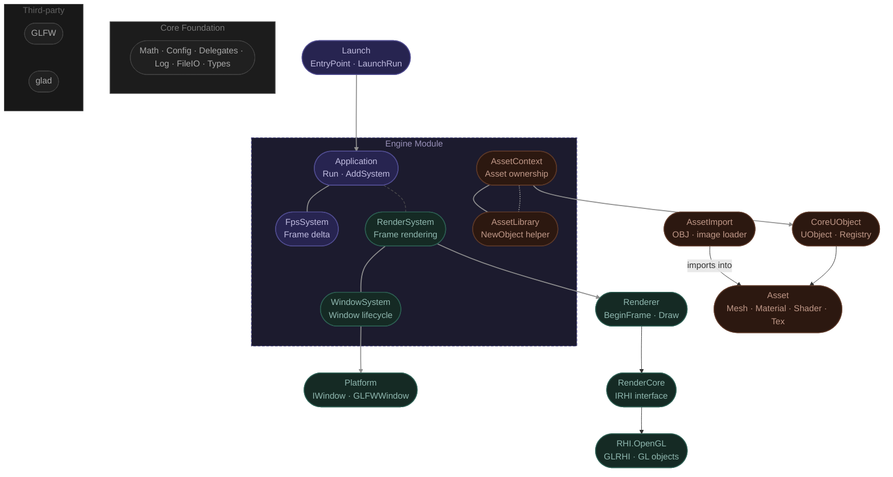

# ClubEngine

ClubEngine is a small C++ game/engine framework. The engine source lives in this repository, while game projects can live anywhere on disk. Projects are connected to the engine through `CLUBENGINE_ROOT`, a `.clubproject` file, and the ClubEngine tool scripts.

## Architecture



## Getting Started

---

## Dependencies

### Windows

Current Windows setup expects **MSYS2 UCRT64 / MinGW**.

Install MSYS2, open the **MSYS2 UCRT64** terminal, then run:

```bash
pacman -S mingw-w64-ucrt-x86_64-gcc
pacman -S mingw-w64-ucrt-x86_64-cmake
pacman -S mingw-w64-ucrt-x86_64-make
```

Add this folder to your Windows `PATH`:

```txt
C:\msys64\ucrt64\bin
```

Check from PowerShell:

```powershell
gcc --version
cmake --version
mingw32-make --version
```

### Linux

Ubuntu/Debian:

```bash
sudo apt update
sudo apt install build-essential cmake ninja-build
```

Check:

```bash
g++ --version
cmake --version
ninja --version
```

---

## First-time tool setup

This sets `CLUBENGINE_ROOT` and adds the correct tool folder to your `PATH`.

### Windows

From the ClubEngine root:

```powershell
.\Tools\Windows\club-init.bat
```

Close and reopen PowerShell.

Check:

```powershell
echo $env:CLUBENGINE_ROOT
where.exe club-build-engine
where.exe club-new-project
where.exe club-build-project
```

### Linux

From the ClubEngine root:

```bash
chmod +x Tools/Unix/*.sh
./Tools/Unix/club-init.sh
source ~/.bashrc
```

If using zsh:

```bash
source ~/.zshrc
```

Check:

```bash
echo $CLUBENGINE_ROOT
which club-build-engine.sh
which club-new-project.sh
which club-build-project.sh
```

---

## Build the engine

The engine version is defined in the root `CMakeLists.txt`:

```cmake
project(ClubEngine VERSION 0.1.0 LANGUAGES C CXX)
```

### Windows

```powershell
club-build-engine Debug
```

### Linux

```bash
club-build-engine.sh Debug
```

Expected generated folders:

```txt
Build/<Platform>/<Config>/<EngineVersion>/
Binaries/<Platform>/<Config>/<EngineVersion>/
Intermediate/<Platform>/<Config>/<EngineVersion>/
```

Example on Windows:

```txt
Build/Win64/Debug/0.1.0/
Binaries/Win64/Debug/0.1.0/
Intermediate/Win64/Debug/0.1.0/
```

Example on Linux:

```txt
Build/Linux64/Debug/0.1.0/
Binaries/Linux64/Debug/0.1.0/
Intermediate/Linux64/Debug/0.1.0/
```

---

## Create a new project

Build the engine first. Then create a project from anywhere.

### Windows

```powershell
club-new-project MyGame 0.1
```

### Linux

```bash
club-new-project.sh MyGame 0.1
```

This creates:

```txt
MyGame/
  MyGame.clubproject
  CMakeLists.txt
  Config/
    DefaultEngine.ini
    DefaultInput.ini
  Content/
  Source/
    Entry.cpp
    MyGame/
      Public/
        MyGame.h
      Private/
        MyGame.cpp
```

The project is generated from:

```txt
Templates/Project/
```

Template placeholders:

```txt
[PROJ_NAME]
[ENGINE_ASSOCIATION]
```

are replaced during project creation.

Project creation also registers the project automatically.

---

## Engine association

A generated project has a `.clubproject` file:

```json
{
    "FileVersion": 1,
    "EngineAssociation": "0.1"
}
```

`FileVersion` is the version of the `.clubproject` file format.

`EngineAssociation` is the compatible engine line. For example:

```txt
0.1
```

matches built engine versions:

```txt
0.1.0
0.1.1
0.1.2
```

but does not match:

```txt
0.2.0
1.0.0
```

---

## Build a project

Run this from the project root.

### Windows

```powershell
cd C:\Users\YourName\Desktop\MyGame
club-build-project Debug
```

### Linux

```bash
cd ~/Desktop/MyGame
club-build-project.sh Debug
```

The project build script:

```txt
1. Reads the .clubproject file
2. Gets EngineAssociation
3. Finds a compatible built engine in Binaries/<Platform>/<Config>/
4. Builds the project
```

---

## Register an existing project

New projects are registered automatically. For an existing project, run this from the project root.

### Windows

```powershell
club-register-project
```

### Linux

```bash
club-register-project.sh
```

Registered projects are stored in:

```txt
Saved/ProjectRegistry.json
```

Projects are identified by path, not only by name, so two projects with the same folder name can both be registered if they are in different directories.

---

## Clean ClubEngine environment setup

### Windows

```powershell
club-clean-env
```

or directly:

```powershell
.\Tools\Windows\club-clean-env.bat
```

### Linux

```bash
club-clean-env.sh
```

Then reopen the terminal.

---

## Notes

- The engine uses C++20.
- Game projects should keep assets inside their own `Content/` folder.
- Engine source should not contain project/game assets.
- `Build/`, `Binaries/`, and `Intermediate/` are generated folders.
- Windows tools use `.bat` files.
- Linux/macOS tools use `.sh` files.
